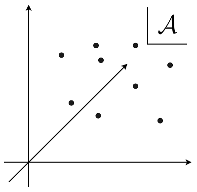
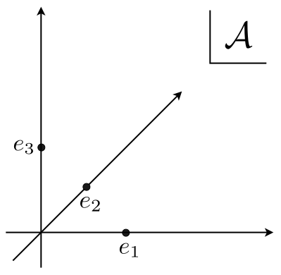
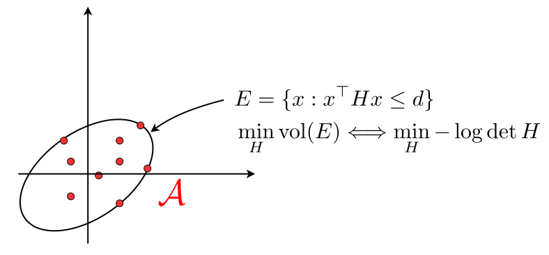

---
layout: two-cols
headerEnable: true
headerTitle: Overview
pageNumber: true
---

 

**Theme : Designing exploration and regularization tailored to the geometry of the action set.**

 

::left::

**Part I**

<Algorithm tight label="Protocol" number="1" title="Adversarial Bandit">

- **Require:** action set $\mathcal A=[K]$
- **Assume:** loss vector $\ell_t\in[0,1]^K$
- **for** $t=1,\dots,T$
  - Choose $p_t\in\Delta_K$
  - Play $a_t\sim p_t$
  - Observe $\ell_t^{(a_t)}$

</Algorithm>

 

<Algorithm tight label="Protocol" number="2" title="Adversarial Linear Bandit">

- **Require:** finite action set $\mathcal A\subseteq\mathbb R^d$
- **Assume:** $|\langle a,z_t\rangle|\le1$ for all $a\in\mathcal A$
- **for** $t=1,\dots,T$
  - Choose $p_t\in\Delta(\mathcal A)$
  - Play $a_t\sim p_t$
  - Observe $\langle a_t,g_t\rangle$

</Algorithm>

$=\left\langle e_{a_t},\ell_t\right\rangle$

::right::

**Part II**

$$\mathcal{A}=[-1,1]^d$$

Explicitly maintaining $K=2^d$ expert weights is inefficient

$\Longrightarrow$ Mirror Descent with perturbation

How to perturb?

How to design regularizer?

$$\mathcal{A}=\{x\in\mathbb{R}^d:\|x\|_2\leq 1\}$$

Take same strategy but improve the

regret order by $O(\sqrt{d})$

---
layout: section
subject: Part I
---

# Part I

---
layout: two-cols
headerEnable: true
headerTitle: "Part I: Exp2 and John's Exploration"
pageNumber: true
---

::left::

### Adversarial Bandit & Exp3 (see Lecture 6)

<Algorithm number="1" title="Exp$3$">

- **Require:** learning rate $\eta>0$
- **Initialize:** $p_1=\frac{1}{K}\mathbf 1\in\Delta_K$
- **for** $t=1,\dots,T$
  - Play $a_t\sim p_t$
  - Observe $\ell_t^{(a_t)}$
  - Estimate $\widehat{\ell}_t^{(i)}=\frac{\mathbf 1\{a_t=i\}}{p_t^{(i)}}\ell_t^{(a_t)}$
  - Update $p_{t+1}^{(i)}\propto p_t^{(i)}\exp(-\eta\widehat\ell_t^{(i)})$

</Algorithm>

$$\begin{aligned}\sum_{t=1}^T\hat{\ell}_t[p_t-u]&\leq\frac{\mathcal{F}_{\psi_\mathcal{V}}(u,\theta_1)}{\eta}+\frac{1}{\eta}\sum_{t=1}^TB_{\psi_\mathcal{V}^*}(\theta_{t+1},\theta_t)\end{aligned}$$

$$\leq\frac{\log{K}}{\eta}+\eta\sum_{i=1}^k p_t^{(i)}\left(\hat{\ell}_t^{(i)}\right)^2$$

Notation

$\mathcal{V}=\Delta_k,\quad\psi(p)=\sum_{i=1}^kp_i\log{p_i},\quad \psi_{\mathcal{V}}=\psi+\iota_{\Delta_k},\quad \theta=D\psi(p),$  
$\mathcal{F}_{\psi_\mathcal{V}}(u,\theta)=\psi_\mathcal{V}(u)+\psi_\mathcal{V}^*(\theta)-\theta[u]$.

::right::

### Adversarial Linear Bandit & Exp2

<Algorithm label="Protocol" number="2" title="Adversarial Linear Bandit">

- **Require:** finite action set $\mathcal A\subseteq\mathbb R^d$
- **Assume:** $|\langle a,g_t\rangle|\le1$ for all $a\in\mathcal A$
- **for** $t=1,\dots,T$
  - Choose $p_t\in\Delta(\mathcal A)$
  - Play $a_t\sim p_t$
  - Observe $\langle a_t,g_t\rangle$

</Algorithm>

Exp2 constructs an unbiased estimator of $g_t$ as
$$\widehat g_t=\left(\mathbb E_{a\sim p_t}\left[aa^\top\right]\right)^{-1}a_t\langle a_t,g_t\rangle.$$

Can we reuse the Exp3 analysis with $\widehat{\ell}_t^{(i)}=\langle a,\widehat{g}_t\rangle$?

$$\begin{aligned}&e^{-x}\leq 1 -x + x^2\quad(x\geq -1)\\ &\text{Apply with }x=\eta\widehat{\ell}_t^{(i)}\geq 0\end{aligned}$$

$$\boxed{\text{Need to design }p_t\text{ s.t. } \eta\vert{}\langle a, \widehat{g}_t\rangle\vert{} \leq 1 \quad \forall a \in \mathcal{A}.}$$

$$\Longleftarrow\max_{a'\in\mathcal{A}}a'^\top\left(\mathbb{E}_{a\sim p_t}[aa^\top]\right)^{-1}a'\leq \frac{1}{\eta}$$

Mix the exponential-weights distribution $q_t$ with an exploration distribution $\mu$ to guarantee sufficient coverage.
$$p_t=(1-\gamma)q_t+\gamma\mu$$

---
layout: two-cols
headerEnable: true
headerTitle: "Part I: Exp2 and John's Exploration"
pageNumber: true
---

::left::

 

$$\begin{gathered}p_t=(1-\gamma)q_t+\gamma\red{\mu},\\[6pt] \Longrightarrow a'^\top \left(\mathbb{E}_{a\sim p_t}\left[aa^\top\right]\right)^{-1}a'\leq \frac{1}{\gamma}a'^\top \left(\mathbb{E}_{a\sim \red{\mu}}\left[aa^\top\right]\right)^{-1}a'\end{gathered}$$

To satisfy $\eta\vert{}\langle a, \hat{z}_t\rangle\vert{} \leq 1 \,(\forall a \in \mathcal{A})$, it suffices to choose $\gamma$ and $\mu$ such that:
$$\max_{a'\in\mathcal{A}}a'^\top \left(\mathbb{E}_{a\sim \red{\mu}}\left[aa^\top\right]\right)^{-1}a'\leq\frac{\gamma}{\eta}$$

Hence, we seek an exploration distribution minimizing the worst-case leverage:
$$\textbf{G-optimal Design}:\quad\min_{\mu \in \Delta(\mathcal{A})} \max_{a \in \mathcal{A}} a^\top \left(\mathbb{E}_{a\sim\mu}\left[aa^\top\right]\right)^{-1} a$$

<h1></h1>

Dual of an equivalent formulation:
<h1></h1>

$\textbf{Origin-centered minimum-volume enclosing ellipsoid}$
<h1></h1>

$$\begin{gathered}\min_{H\in\mathbb{S^n}}f(H)=-\log\det{H}\\ \text{s.t.}\quad a^\top H a\leq d\quad\forall a\in \mathcal{A}\end{gathered}$$

::right::

 
 
 
 
 
 
 

$$\nabla f(H)=-H^{-1},\quad \mathcal{N}_{\Omega}(H)=\left\{\sum_{i\,:\,a_i^\top Ha_i=d}\lambda_ia_ia_i^\top:\lambda_i\geq 0\right\}$$

Optimality condition:
$$H^{*-1}=\sum_{i\,:\,a_i^\top H^*a_i=d}\lambda_i^*a_ia_i^\top\quad\text{for some}\quad\lambda_i^*\geq 0$$

Multiplying by $H^*$ and taking the trace of both sides yields

$$d=\operatorname{tr}(H^*H^{*-1})=\sum_{i\,:\,a_i^\top H^*a_i=d}\lambda_i^*\operatorname{tr}(a_i^\top H^*a_i)=d\sum_{i\,:\,a_i^\top H^*a_i=d}\lambda_i^*$$

Letting $\mu^*(a_i)=\lambda_i^*$, we have

$$\max_{a\in\mathcal{A}}a^\top M_{\mu^*}^{-1}a=\max_{a\in\mathcal{A}}a^\top H^*a\leq d\Longrightarrow \eta d\leq\gamma.$$

---
layout: two-cols
headerEnable: true
headerTitle: "Part I: Exp2 and John's Exploration"
pageNumber: true
---

::left::

## EXP2 with John's Exploration

<Algorithm number="2" title="EXP2 with John's Exploration">

- **Require:** learning rate $\eta>0$, exploration rate $\gamma\in[0,1]$
- **Require:** John's exploration distribution $\mu\in\Delta(\mathcal A)$
- **Initialize:** $q_1(a)=\frac{1}{K}$ for all $a\in\mathcal A$
- **for** $t=1,\dots,T$
  - Set $p_t=(1-\gamma)q_t+\gamma\mu$
  - Play $a_t\sim p_t$
  - Observe $\langle a_t,g_t\rangle$
  - Estimate $\widehat g_t=(\mathbb E_{a\sim p_t}[aa^\top])^{-1}a_t\langle a_t,g_t\rangle$
  - Update $q_{t+1}(a)\propto q_t(a)\exp(-\eta\langle a,\widehat g_t\rangle)$

</Algorithm>

<TheoremBox label="Theorem" number="4" name="EXP2 with John's exploration">

EXP2 with John's exploration satisfies, if $\eta d\le \gamma$,

$$\mathrm{Regret}_T\leq 2\gamma T+\frac{\log K}{\eta}+\eta Td.$$

In particular, setting $\gamma=\eta d$ and
$\eta=\sqrt{\frac{\log K}{3Td}}$ gives

$$\mathrm{Regret}_T\leq 2\sqrt{3Td\log K}.$$

</TheoremBox>

::right::

## Limitation

 

John's exploration has small support, but EXP2 still maintains exponential weights over all actions.

 

When $|\mathcal A|$ is large, e.g. $|\mathcal A|=2^d$, sampling from

$$q_t(a)\propto \exp\!\left(-\eta\sum_{s<t}\langle a,\widehat g_s\rangle\right)$$

may not be computationally efficient.

 

This motivates action geometry-specific **Online Stochastic Mirror Descent (OSMD)**.

$\Longrightarrow$ Part II

---
layout: section
subject: Part II
---

# Part II

---
layout: two-cols
headerEnable: true
headerTitle: "Part II: OSMD on Hypercube"
pageNumber: true
---

::left::

### OSMD on Hypercube

<Algorithm number="3" title="OSMD for Hypercube">

- **Require:** learning rate $\eta>0$
- **Initialize:** internal decision $a_1=0\in[-1,1]^d$
- **for** $t=1,\dots,T$
  - Construct a sampling distribution $p_t$ around $a_t$
  - Sample the played action $\widetilde a_t\sim p_t$
  - Observe $\langle \widetilde a_t,g_t\rangle\in[-1,1]$
  - Estimate $\widehat g_t=\left(\mathbb E[\widetilde a_t\widetilde a_t^\top\mid\mathcal{F}_{t-1}]\right)^{-1}\widetilde a_t\langle \widetilde a_t,g_t\rangle$
  - Update the internal decision
    - $a_{t+1}=\nabla \psi_{\mathcal{A}}^*(\nabla \psi(a_t)-\eta\widehat g_t)$

</Algorithm>

<h1></h1>

OSMD maintains a single internal point $a_t\in[−1,1]^d$ and realizes it through an efficiently sampleable distribution.

<h1></h1>

A natural first choice is coordinate-wise randomized rounding:
$$\begin{gathered}\begin{cases}q_t^{\mathrm{Bern}}(\tilde{a}_t^{(i)}=1)=\dfrac{1+a_t^{(i)}}{2},\\ q_t^{\mathrm{Bern}}(\tilde{a}_t^{(i)}=-1)=\dfrac{1-a_t^{(i)}}{2}\end{cases}\text{independently for }i\in[d]\Longrightarrow \mathbb{E}[\tilde{a}_t\mid\mathcal{F}_{t-1}]=a_t\end{gathered}$$

<h1></h1>

Unbiased estimator: $\widehat{g}_t=(M_{t}^{\mathrm{Bern}})^{-1}\tilde{a}_t\langle \tilde{a}_t,g_t\rangle\quad \left(M_{t}^{\mathrm{Bern}}=\mathbb{E}[\widetilde{a}\widetilde{a}^\top\mid\mathcal{F}_{t-1}]\right)$

::right::

<h1></h1>

Standard OMD inequality:
$$\begin{aligned}\sum_{t=1}^T\widehat{g}_t[a_t-u]&\leq\frac{\mathcal{F}_{\psi_\mathcal{A}}(u,\theta_1)}{\eta}+\frac{1}{\eta}\sum_{t=1}^TB_{\psi_\mathcal{A}^*}(\theta_t -\eta\widehat{g}_t,\theta_t)\end{aligned}$$

Match mirror geometry to sampling geometry

$$\begin{aligned}B_{\psi_{\mathcal{A}}^*}(\theta_t -\eta\widehat{g}_t, \theta_t) &\approx \frac{\eta^2}{2} \widehat{g}_t^\top D^2\psi_{\mathcal{A}}^*(\theta_t) \widehat{g}_t.\end{aligned}$$

Since $\mathbb{E}[\widetilde{g}_t^\top M_{t}^{\mathrm{Bern}}\widetilde{g}_t\mid\mathcal{F}_{t-1}]=d$, we seek a Hessian such that

$$D^2\psi_{\mathcal{A}}^*(\theta_t) \preceq M_{t}^{\mathrm{Bern}}.$$

For coordinate-wise randomized rounding,
$$M_{t}^{\mathrm{Bern}} = a_t a_t^\top + \text{Cov}(\tilde{a}_t \mid \mathcal{F}_{t-1}),$$

and its covariance is a realizable choice:
$$D^2\psi_{\mathcal{A}}^*(\theta_t) = \text{Cov}(\tilde{a}_t \mid \mathcal{F}_{t-1}) \preceq M_{t}^{\mathrm{Bern}}.$$

---
layout: two-cols
headerEnable: true
headerTitle: "Part II: OSMD on Hypercube"
pageNumber: true
---

::left::

## Deriving the Regularizer for Bernoulli sampler

<h1></h1>

$$\boxed{D^2\psi_{\mathcal{A}}^*(\theta_t) = \text{Cov}(\tilde{a}_t \mid \mathcal{F}_{t-1})}$$

For the Bernoulli rounding $\widetilde{a}_t\sim q_t^{\mathrm{Bern}}$,

$$\text{Cov}(\tilde{a}_t \mid \mathcal{F}_{t-1}) = \text{diag}\left(1 - (a_t^{(i)})^2\right).$$

Thus, we choose the dual potential so that

$$D^2\psi_{\mathcal{A}}^*(\theta) = \text{diag}(1 - a_i^2), \quad a = \nabla\psi_{\mathcal{A}}^*(\theta).$$

Since the Hessian is diagonal, each coordinate satisfies
$$\frac{da_i}{d\theta_i} = 1 - a_i^2 \implies a_i = \tanh \theta_i.$$

Integrating gives
$$\begin{aligned}\psi_{\mathcal{A}}^*(\theta) &= \sum_{i=1}^d \log \cosh \theta_i\quad\text{and its primal regularizer is}\\ \psi(a) &= \frac{1}{2} \sum_{i=1}^d [(1 + a_i) \log(1 + a_i) + (1 - a_i) \log(1 - a_i)]\end{aligned}$$

::right::

## Why Pure Bernoulli Rounding Is Not Enough

We designed the regularizer so that locally

$$B_{\psi_{\mathcal{A}}^*}(\theta_t - \eta\hat{g}_t, \theta_t) \approx \frac{\eta^2}{2} \hat{g}_t^\top D^2\psi_{\mathcal{A}}^*(\theta_t)\hat{g}_t.$$

To turn this into regret analysis, we need an upper bound.It is enough to ensure $\eta\Vert{}\hat{g}_t\Vert{}_\infty \leq \frac{1}{2}$, because then

$$B_{\psi_{\mathcal{A}}^*}(\theta_t - \eta\hat{g}_t, \theta_t) \lesssim \eta^2 \hat{g}_t^\top D^2\psi_{\mathcal{A}}^*(\theta_t)\hat{g}_t \leq \eta^2d.$$

Since $\|\widehat{g}_t\|_{\infty} \le \|(M_t^{\text{Ber}})^{-1} \widetilde{a}_t\|_{\infty}$, one sufficient condition is
$$\sup_{\widetilde{a}_t \in \{-1,+1\}^d} \|(M_t^{\text{Ber}})^{-1}\widetilde{a}_t\|_{\infty} \lesssim\frac{1}{\eta}.$$

But when $a_t$ is close to a vertex,

$$\text{Cov}(\tilde{a}_t \mid \mathcal{F}_{t-1}) \approx 0, \qquad M_t^{\text{Ber}} \approx a_t a_t^{\top}$$

is nearly rank-one, so the inverse can be arbitrarily large.

Pure Bernoulli rounding does not guarantee $\eta\|\widehat{g}_t\|_{\infty} \le \frac{1}{2}$.

---
layout: two-cols
headerEnable: true
headerTitle: "Part II: OSMD on Hypercube"
pageNumber: true
---

::left::

## Designing Exploration for Range Control
<h1></h1>

$$\eta\Vert{}\widehat{g}_t\Vert{}_{\infty} \le \frac{1}{2}, \qquad \widehat{g}_t = M_t^{-1}\widetilde{a}_t\langle \widetilde{a}_t, g_t \rangle.$$

Since $\vert{}\langle \widetilde{a}_t, g_t \rangle\vert{} \le 1$, it suffices to control
$$\sup_{x \in \text{supp}(p_t)} \Vert{}M_t^{-1}x\Vert{}_{\infty}.$$

Fair-vertex exploration provides isotropic coverage

$$\begin{aligned}&p_t = (1 - \gamma)q_t^{\text{Bern}} + \gamma \text{Unif}\{-1, +1\}^d\\[4pt] \Longrightarrow &M_t = (1 - \gamma)(a_t a_t^{\top} + V_t) + \gamma I \succeq \gamma I\end{aligned}$$

Since $M_t \succeq \gamma I$ and $\Vert{}x\Vert{}_2 = \sqrt{d}$ for all $x \in \text{supp}(p_t)$, we obtain

$$\Vert{}\widehat{g}_t\Vert{}_{\infty}\leq\sup_{x \in \text{supp}(p_t)} \Vert{}M_t^{-1}x\Vert{}_{\infty}  \leq \frac{\sqrt{d}}{\gamma}$$

Thus, choosing $\gamma \ge 2\eta\sqrt{d}$ guarantees the required range control.

$$\boxed{2\eta\sqrt{d}\leq \gamma \Longrightarrow\eta\Vert{}\widehat{g}_t\Vert{}_{\infty} \le \frac{1}{2}}$$

::right::

<TheoremBox label="Theorem" number="5">

For the hypercube/cross-polytope pair

$$\mathcal A=\{a:\|a\|_\infty\le1\},\qquad\mathcal Z=\{z:\|z\|_1\le1\},$$

OSMD with the entropy regularizer satisfies, if $2\eta \sqrt{d}\leq \gamma$,

$$\mathrm{Regret}_T\le\gamma T+\frac{d\log 2}{\eta}+\eta\sum_{t=1}^T\sum_{i=1}^d\mathbb E\left[(1-(a_t^{(i)})^2)\widehat z_t^{(i)})^2\right].$$

With $\gamma=2d\sqrt{\frac{\log 2}{3T}}$ and
$\eta=\sqrt{\frac{\log 2}{3T}}$,

$$\mathrm{Regret}_T\le 2d\sqrt{3T\log2}.$$

</TheoremBox>

