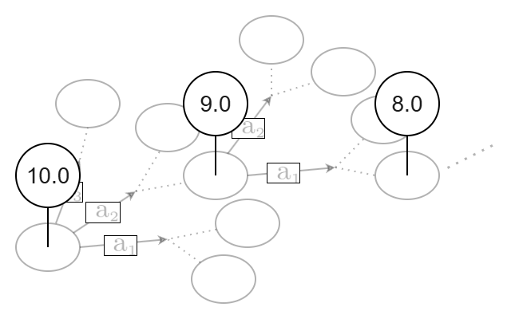
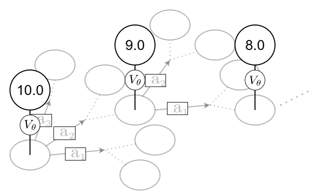
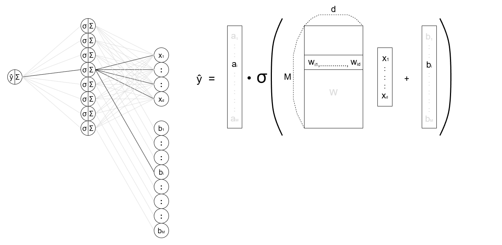

---
pageNumber: true
---

  <Toc minDepth="1" maxDepth="2" />

---
layout: section
subject: Overview
---

# Overview

---
layout: default
headerEnable: true
headerTitle: Overview
pageNumber: true
---

Overview

<ul>
  <li v-click>
    Deep Reinforcement Learning has attracted much attention as a possible approach to complex sequential decision making.
  </li>

  <li v-click style="margin-top: 18px;">
    Semi-gradient TD is one of the most basic components in RL, but its convergence is not guaranteed in general.
  </li>

  <li v-click style="margin-top: 18px;">
    Even with linear function approximation, one can construct examples where semi-gradient TD diverges.
  </li>

  <li v-click style="margin-top: 18px;">
    In this work, we show that for two-layer neural networks, adding noise can lead to convergence.
  </li>
</ul>

---
layout: section
subject: Background
---

# Background

---
layout: default
headerEnable: true
headerTitle: Background
pageNumber: true
---

## Reinforcement Learning

The goal of Reinforcement Learning (RL) is to learn a good policy in sequential decision making.

$$\begin{alignedat}{4}&\text{State Space}\quad&\mathcal{S}&\subseteq\mathbb{R}^n,\;\text{bounded}\qquad&\text{Reward}\quad&r&:\mathcal{S}\times\mathcal{A}\to[0,1]\\ &\text{Action Space}\quad&\mathcal{A}&\subseteq\mathbb{R}^m,\;\text{bounded}\qquad&\text{Policy}\quad&\pi&:\mathcal{S}\to\mathcal{P}(\mathcal{A})\\ &\text{Transition Model}\quad&P&:\mathcal{S}\times\mathcal{A}\to\mathcal{P}(\mathcal{S})\qquad&&&\end{alignedat}$$

$$\begin{aligned}&\text{We are interested in total return:}\\ &\qquad \mathbb{E}_{\substack{A_t\sim\pi(\cdot\mid S_t)\\ S_{t+1}\sim P(\cdot\mid S_t,A_t)}}\left[\sum_{t=0}^\infty r(S_t,A_t)\bigg|S_0=s\right]\quad\text{for all }s\in\mathcal{S}\end{aligned}$$

$$\begin{aligned}&\text{Value function for }\pi\\ &\qquad V^\pi(s)=\mathbb{E}_{\substack{A_t\sim\pi(\cdot\mid S_t)\\ S_{t+1}\sim P(\cdot\mid S_t,A_t)}}\left[\sum_{t=0}^\infty{\color{red}\gamma^t}r(S_t,A_t)\bigg|S_0=s\right]\quad\gamma\in(0,1)\end{aligned}$$

Without discounting, value may diverge, making it  
impossible to compare states: 
From $s_1$ : $+1+1+1+1+1+\cdots$  
From $s_2$ : $+2+2+2+2+2+\cdots$

$$\begin{aligned}&\text{Bellman Equation}\\ &\qquad V^\pi(s)=\mathbb{E}_{\substack{A\sim\pi(\cdot\mid s)\\ S'\sim P(\cdot\mid s,A)}}\bigg[r(s,A)+\gamma V^\pi(S')\bigg]\end{aligned}$$

<SequentialDecisionFrames />

---
layout: default
headerEnable: true
headerTitle: Background
---

### Example: Computing the Value Function

$$\begin{alignedat}{2}&\text{Definition}&&\text{Bellman Equation}\\ &\quad V^\pi(s)=\mathbb{E}_{\substack{A_t\sim\pi(\cdot\mid S_t)\\ S_{t+1}\sim P(\cdot\mid S_t,A_t)}}\left[\sum_{t=0}^\infty\gamma^tr(S_t,A_t)\bigg|S_0=s\right]\qquad&&\qquad V^\pi(s)=\mathbb{E}_{\substack{A\sim\pi(\cdot\mid s)\\ S'\sim P(\cdot\mid s,A)}}\bigg[r(s,A)+\gamma V^\pi(S')\bigg]\end{alignedat}$$

Grid-world setting

Start state

Goal state

$\pi$: $\mathrm{Uniform}(\mathcal{A})$  
$P$: $\mathrm{Uniform}(\mathcal{S})$  
$r \equiv 1,\quad \gamma=1$

  
  

    Unknown in  
    RL
  

<DpRlGridCompare />

---
layout: two-cols
headerEnable: true
headerTitle: Background
pageNumber: true
---

### TD Learning with Function Approximation

  

    

      
    

  

  

    
  

::left::

#### Gradient TD

We approximate the value function by $V(s;\theta)$.

$$\begin{aligned}L^{*}(\theta)&=\frac{1}{2}\mathbb{E}_{S}\left[\left(V^\pi(S)-V(S;\theta)\right)^2\right]\\ &=\frac{1}{2}\mathbb{E}_{S}\left[\left(\mathbb{E}_{A,S'}\left[r+\gamma V^\pi(S')\right]-V(S;\theta)\right)^2\right]\end{aligned}$$

This motivates

$$L(\theta):=\frac{1}{2}\mathbb{E}_{S}\left[\left(\mathbb{E}_{A,S'}\left[r+\gamma V(S';\theta)\right]-V(S;\theta)\right)^2\right]$$

  

    

  

  

    Call this term "Target".
  

  

$$\begin{aligned}&\text{Recall Bellman Equation}\\ &\qquad V^\pi(s)=\mathbb{E}_{A,S'}\bigg[r(s,A)+\gamma V^\pi(S')\bigg]\end{aligned}$$

  

The descent direction is

$$\begin{aligned}-\nabla_\theta L(\theta)=\mathbb{E}_{S}\bigg[\bigg(\mathbb{E}_{A,{\color{red}S'}}&\left[r+\gamma V(S';\theta)\right]-V(S;\theta)\bigg)\\ &\bigg(\nabla_\theta V(S;\theta)-\gamma\mathbb{E}_{{\color{red}S'}}\left[\nabla_\theta V(S';\theta)\right]\bigg)\bigg]\end{aligned}$$

<strong class="danger">Double sampling issue</strong> : Unbiased sample-based gradient estimate requires   two independent next-state samples from the same state.

::right::

#### Semi-Gradient TD

In semi-gradient TD, we first take the descent direction of $L^*$.

$$-\nabla_\theta L^{*}(\theta)=\mathbb{E}_{S}\left[\left(\mathbb{E}_{A,S'}\left[r+\gamma V^\pi(S')\right]-V(S;\theta)\right)\nabla_\theta V(S;\theta)\right]$$

Then, replace the unknown true value by the current approximation.

$$g(\theta)=\mathbb{E}_{S}\left[\left(\mathbb{E}_{A,S'}\left[r+\gamma V(S';\theta)\right]-V(S;\theta)\right)\nabla_\theta V(S;\theta)\right]$$

In general, this vector field is not conservative: $\partial_{\theta_j}(g)_i\ne\partial_{\theta_i}(g)_j$. Thus, semi-gradient TD avoids the double-sampling issue, but it is generally not the gradient flow of any objective function.

---
layout: two-cols
headerEnable: true
headerTitle: Background
pageNumber: true
---

### Semi-Gradient TD: Optimization Perspective

 

::left::

#### Gradient TD

$$\begin{aligned}&\text{Fixed objective}\\ &\qquad\;\, L(\theta)=\frac{1}{2}\mathbb{E}_{S}\left[\left(\mathbb{E}_{A,S'}\left[r+\gamma V(S';\theta)\right]-V(S;\theta)\right)^2\right]\\ &\text{Direction}\\ &-\nabla_\theta L(\theta)=\mathbb{E}_{S}\bigg[\bigg(\mathbb{E}_{A,S'}\left[r+\gamma V(S';\theta)\right]-V(S;\theta)\bigg)\\ &\qquad\qquad\qquad\qquad\qquad\bigg(\nabla_\theta V(S;\theta)-\gamma\mathbb{E}_{S'}\left[\nabla_\theta V(S';\theta)\right]\bigg)\bigg]\end{aligned}$$

#### Semi-Gradient TD

$$\begin{aligned}&\text{Fixed objective}\\ &\qquad\qquad\qquad\text{No such objective in general}\\ &\text{Direction}\\ &\quad g(\theta)=\mathbb{E}_{S}\left[\left(\mathbb{E}_{A,S'}\left[r+\gamma V(S';\theta)\right]-V(S;\theta)\right)\nabla_\theta V(S;\theta)\right]\end{aligned}$$

::right::

#### Moving Target Perspective of Semi-Gradient TD

  

  The difference between $-\nabla_\theta L(\theta)$ and $g(\theta)$ is whether we differentiate the target term.

So, if the target is frozen, the two directions coincide, and $g(\theta)$ can be viewed as the descent direction of a frozen-target objective. To express this, we separate the frozen target parameter and the optimizing parameter.

$$H({\color{red}\theta},{\color{#2563eb}\omega})=\frac{1}{2}\mathbb{E}_{S,A,S'}\left[\left(r+\gamma V(S';{\color{red}\theta})-V(S;{\color{#2563eb}\omega})\right)^2\right]$$

For fixed $\theta$, descent in $\omega$ gives $g(\theta)=-\nabla_\omega H(\theta,\omega)\big|_{\omega=\theta}$.

Updating along $g(\theta_t)$ gives
$$\theta_{t+1}=\theta_t+\alpha g(\theta_t)=\theta_t-\alpha\nabla_\omega H(\theta_t,\theta_t).$$
This is <strong class="danger">one-step optimization + moving target</strong>: optimize $H(\theta_t,\cdot)$ for one step, then move the objective to $H(\theta_{t+1},\cdot)$.

  

  <MovingTargetFrames />

---
layout: two-cols
headerEnable: true
headerTitle: Background
pageNumber: true
---

## Mean-Field Regime

 

::left::

#### Two-layer neural network

$$\begin{gathered}\hat{y}(x;\boldsymbol{\theta})=\frac{1}{M}\sum_{i=1}^Ma_i\sigma\left(\left\langle w_i,x\right\rangle+b_i\right)=:\frac{1}{M}\sum_{i=1}^M\phi(x;\theta_i)\\ \bigg(\theta_i:=\left(a_i,w_i,b_i\right)\in\mathbb{R}^{d}\bigg)\end{gathered}$$

$$\begin{gathered}\hat{y}(x;\boldsymbol{\theta})=\frac{1}{M}\sum_{i=1}^Ma_i\sigma\left(\left\langle w_i,x\right\rangle+b_i\right)=:\frac{1}{M}\sum_{i=1}^M\phi(x;\theta_i)\\ \bigg(\theta_i:=\left(a_i,w_i,b_i\right)\in\mathbb{R}^{d}\bigg)\end{gathered}$$

The output $\hat{y}$ is invariant to swapping $\theta_i$ and $\theta_j$.
This motivates the expression

$$\begin{gathered}\hat{y}(x;\boldsymbol{\theta})=\hat{y}(x;\mu_M):=\int \phi(x;\theta)\,\mu_M(\mathrm{d}\theta)\\ \left(\mu_M=\frac{1}{M}\sum_{i=1}^M\delta_{\theta_i}\in\mathcal{P}(\mathbb{R}^d)\right)\end{gathered}$$

::right::

#### Infinite width limit

---
layout: section
subject: Convergence Analysis
---

# Convergence Analysis

---
layout: default
headerEnable: true
headerTitle: Convergence Analysis
pageNumber: true
---

**Policy evaluation**

  

    Theorem 1
    (Instantaneous optimality gap decay).
  

  

Under the mixed-smoothness assumption and the stability condition $\rho\tau>L_p$, the one-step frozen-target optimality gap decays exponentially:

$$G(t):=F(q_t,q_t)-F(q_t,\pi_{q_t,*}),\qquad G(t)\leq e^{-2(\rho\tau-L_p)t}G(0).$$

  

The semi-gradient dynamics is not analyzed through decrease of a fixed objective.
Instead, we compare $q_t$ with the instantaneous frozen-target minimizer $\pi_{q_t,*}$.

---
layout: default
headerEnable: true
headerTitle: Convergence Analysis
pageNumber: true
---

**Policy evaluation**

  

    Lemma 1
    (Stability of the Gibbs response map).
  

  

Let $T(\mu):=\pi_{\mu,*}(\theta)d\theta$ be the frozen-target Gibbs response map. Then

$$W_2(T(\mu_1),T(\mu_2))\leq \frac{L_p}{\rho\tau}W_2(\mu_1,\mu_2).$$

In particular, if $\rho\tau>L_p$, then $T$ is a contraction.

  

This converts the local frozen-target relaxation into stability of the moving target itself.

---
layout: default
headerEnable: true
headerTitle: Convergence Analysis
pageNumber: true
---

**Policy evaluation**

  

    Corollary 1
    (Convergence to a self-consistent equilibrium).
  

  

Under $\rho\tau>L_p$, there exists a unique self-consistent equilibrium $\pi_*$, and the noisy mean-field semi-gradient TD dynamics converges exponentially:

$$W_2(q_t,\pi_*)\leq \frac{\sqrt{2\rho\tau}}{\rho\tau-L_p}\sqrt{G(0)}e^{-(\rho\tau-L_p)t}.$$

  

The same stability condition controls both the frozen-target optimization error and the movement of the target.

---
layout: default
headerEnable: true
headerTitle: Convergence Analysis
pageNumber: true
---

**Extension to Soft Q-learning**

  

    Proposition 4
    (Soft Q-learning convergence).
  

  

For the entropy-regularized off-policy soft Q-learning functional, assume the same Gibbs-form characterization, uniform LSI, and mixed-smoothness estimate with constant $L_p^Q$. If $\rho\tau>L_p^Q$, then the Gibbs response map has a unique fixed point $\pi_*^Q$, and

$$W_2(q_t,\pi_*^Q)\leq \frac{\sqrt{2\rho\tau}}{\rho\tau-L_p^Q}\sqrt{G_Q(0)}e^{-(\rho\tau-L_p^Q)t}.$$

  

The same entropy-versus-sensitivity mechanism extends beyond policy evaluation.

---
layout: section
subject: Conclusion
---

# Conclusion

---
layout: section
subject: Thank you
hideInToc: true
---
