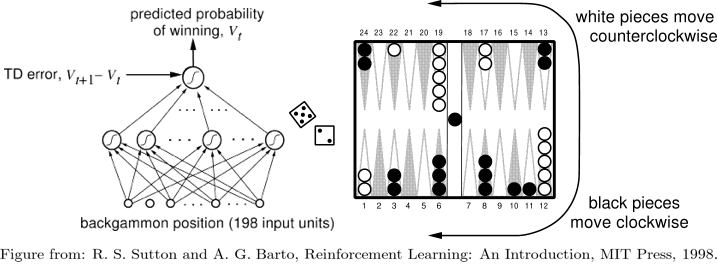
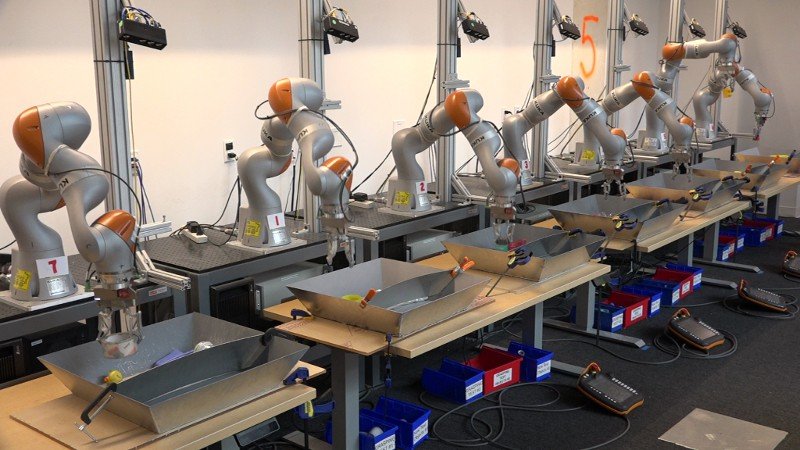
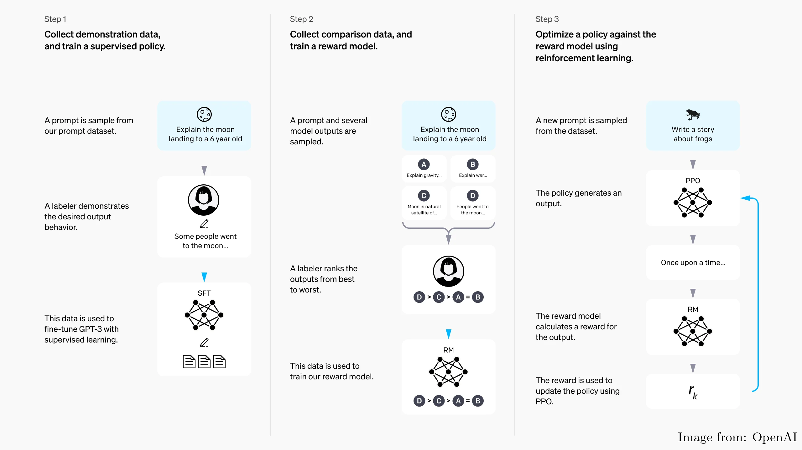
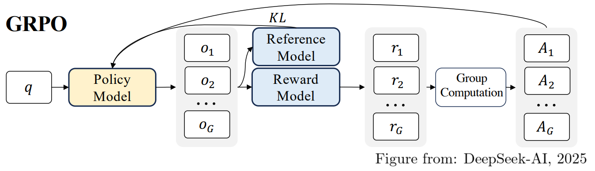
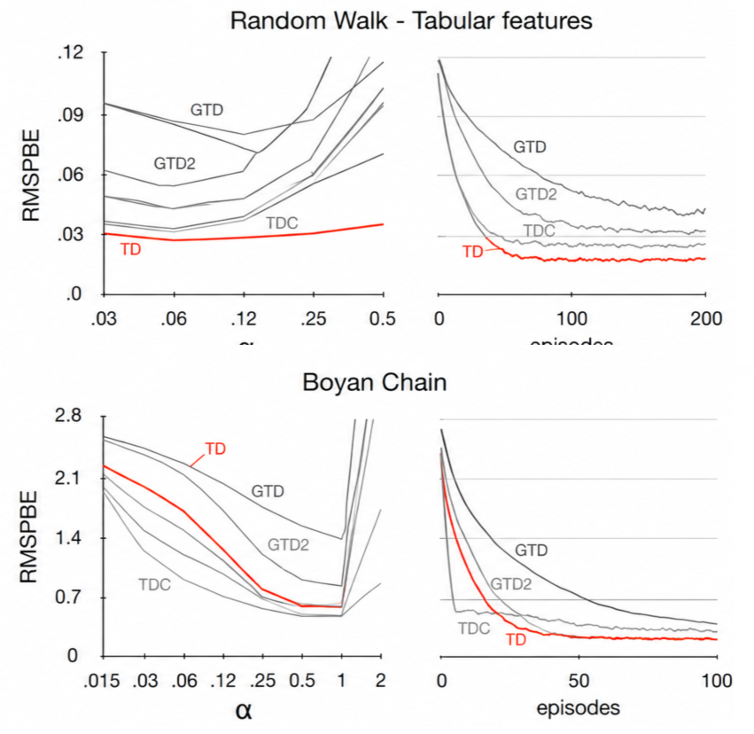
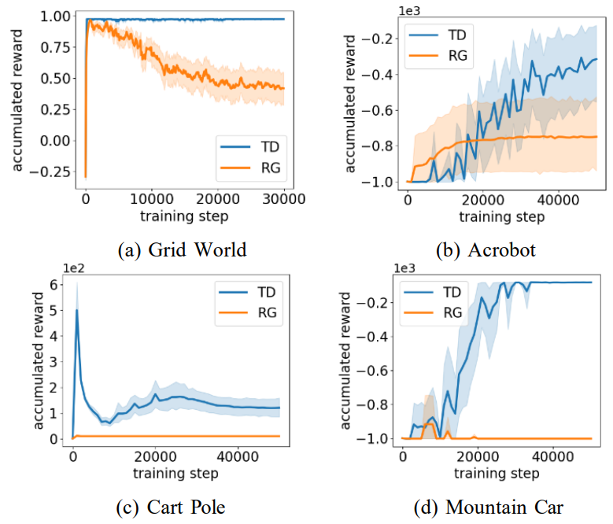
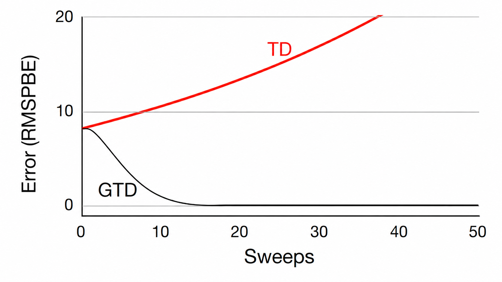
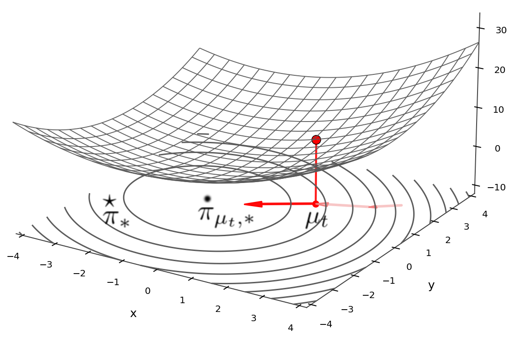
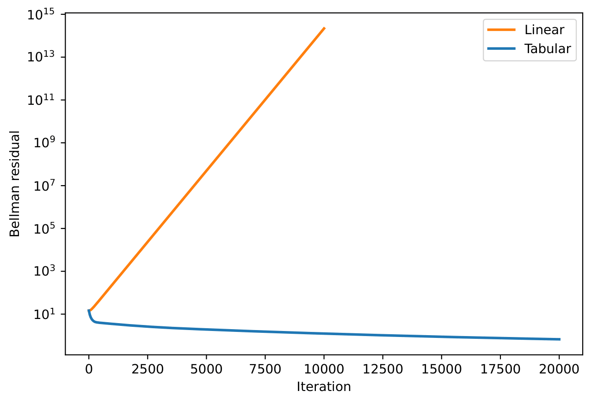
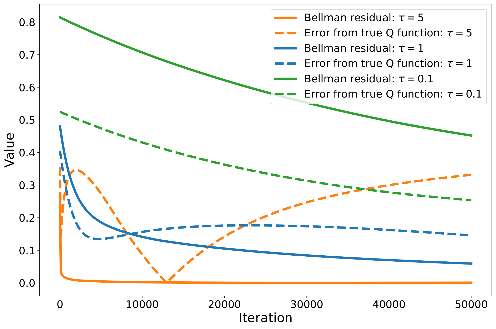

---
pageNumber: true
---

  <Toc minDepth="1" maxDepth="2" />

---
layout: section
subject: Introduction
---

# Introduction

---
layout: default
headerEnable: true
pageNumber: true
---

Introduction

  

    
    

      
1995

      
TD-Gammon

      
A landmark success of TD learning.

      
Figure from: Sutton &amp; Barto, Reinforcement Learning, 1998.

    

  

  

    
    

      
2018

      
QT-Opt

      
Large-scale Q-learning for robotic grasping.

      
Figure from: Kalashnikov et al., 2018.

    

  

  

    
    

      
2019

      
OpenAI Five

      
Large-scale RL for complex team games..

      
© Valve Corporation.

    

  

  

    
    

      
2022

      
RLHF

      
RL from learned human preferences.

      
Image from: OpenAI.

    

  

  

    
    

      
2019–2025

      
Dreamer V1–4

      
Learning world models for control.

      
Figure from: Hafner et al., 2023.

    

  

  

    These successes of Deep RL are based on <strong class="accent">TD learning</strong>. However, the convergence of TD learning with function approximation remains poorly understood.
  

  

    Recent successes in LLM post-training are often not based on TD learning, as they can use outcome-based feedback after generating complete answers.
  

  

    

    

      
      

        
recent

        
LLM post-training

        
GRPO, DPO, etc.

        
Figure from: DeepSeek-AI, 2025.

      

    

  

  Still, in continuing or long-horizon tasks, such full feedback is not always available, TD learning remains a fundamental component for deep RL.

  Our question:
  Can TD learning converge with neural-network approximation?

---
layout: section
subject: Background
---

# Background

---
layout: default
headerEnable: true
headerTitle: Background
pageNumber: true
---

## Reinforcement Learning

The goal of Reinforcement Learning (RL) is to learn a good policy in sequential decision making.

$$\begin{alignedat}{4}&\text{State Space}\quad&\mathcal{S}&\subseteq\mathbb{R}^n,\;\text{bounded}\qquad&\text{Reward}\quad&r&:\mathcal{S}\times\mathcal{A}\to[0,1]\\ &\text{Action Space}\quad&\mathcal{A}&\subseteq\mathbb{R}^m,\;\text{bounded}\qquad&\text{Policy}\quad&\pi&:\mathcal{S}\to\mathcal{P}(\mathcal{A})\\ &\text{Transition Model}\quad&P&:\mathcal{S}\times\mathcal{A}\to\mathcal{P}(\mathcal{S})\qquad&&&\end{alignedat}$$

$$\begin{aligned}&\text{We are interested in total return:}\\ &\qquad \mathbb{E}_{\substack{A_t\sim\pi(\cdot\mid S_t)\\ S_{t+1}\sim P(\cdot\mid S_t,A_t)}}\left[\sum_{t=0}^\infty r(S_t,A_t)\bigg|S_0=s\right]\quad\text{for all }s\in\mathcal{S}\end{aligned}$$

$$\begin{aligned}&\text{Value function for }\pi\\ &\qquad V^\pi(s)=\mathbb{E}_{\substack{A_t\sim\pi(\cdot\mid S_t)\\ S_{t+1}\sim P(\cdot\mid S_t,A_t)}}\left[\sum_{t=0}^\infty{\color{red}\gamma^t}r(S_t,A_t)\bigg|S_0=s\right]\quad\gamma\in(0,1)\end{aligned}$$

Without discounting, value may diverge, making it  
impossible to compare states: 
From $s_1$ : $+1+1+1+1+1+\cdots$  
From $s_2$ : $+2+2+2+2+2+\cdots$

$$\begin{aligned}&\text{Bellman Equation}\\ &\qquad V^\pi(s)=\mathbb{E}_{\substack{A\sim\pi(\cdot\mid s)\\ S'\sim P(\cdot\mid s,A)}}\bigg[r(s,A)+\gamma V^\pi(S')\bigg]\end{aligned}$$

<SequentialDecisionFrames />

---
layout: default
headerEnable: true
headerTitle: Background
---

### Example: Computing the Value Function

$$\begin{alignedat}{2}&\text{Definition}&&\text{Bellman Equation}\\ &\quad V^\pi(s)=\mathbb{E}_{\substack{A_t\sim\pi(\cdot\mid S_t)\\ S_{t+1}\sim P(\cdot\mid S_t,A_t)}}\left[\sum_{t=0}^\infty\gamma^tr(S_t,A_t)\bigg|S_0=s\right]\qquad&&\qquad V^\pi(s)=\mathbb{E}_{\substack{A\sim\pi(\cdot\mid s)\\ S'\sim P(\cdot\mid s,A)}}\bigg[r(s,A)+\gamma V^\pi(S')\bigg]\end{alignedat}$$

Grid-world setting

Start state

Goal state

$\pi$: $\mathrm{Uniform}(\mathcal{A})$  
$P$: $\mathrm{Uniform}(\mathcal{S})$  
$r \equiv 1,\quad \gamma=1$

  
  

    Unknown 
    in RL
  

<DpRlGridCompare />

---
layout: two-cols
headerEnable: true
headerTitle: Background
pageNumber: true
---

### TD Learning with Function Approximation

  

    

      
    

  

  

    
  

::left::

#### Residual Gradient (Baird, 1995)

We approximate the value function by $V(s;\theta)$.

$$\begin{aligned}L^{*}(\theta)&=\frac{1}{2}\mathbb{E}_{S}\left[\left(V^\pi(S)-V(S;\theta)\right)^2\right]\\ &=\frac{1}{2}\mathbb{E}_{S}\left[\left(\mathbb{E}_{A,S'}\left[r+\gamma V^\pi(S')\right]-V(S;\theta)\right)^2\right]\end{aligned}$$

This motivates

$$L(\theta):=\frac{1}{2}\mathbb{E}_{S}\left[\left(\mathbb{E}_{A,S'}\left[r+\gamma V(S';\theta)\right]-V(S;\theta)\right)^2\right]$$

  

    

  

  

    Call this term "Target".
  

  

$$\begin{aligned}&\text{Recall Bellman Equation}\\ &\qquad V^\pi(s)=\mathbb{E}_{A,S'}\bigg[r(s,A)+\gamma V^\pi(S')\bigg]\end{aligned}$$

  

The descent direction is

$$\begin{aligned}-\nabla_\theta L(\theta)=\mathbb{E}_{S}\bigg[\bigg(\mathbb{E}_{A,{\color{red}S'}}&\left[r+\gamma V(S';\theta)\right]-V(S;\theta)\bigg)\\ &\bigg(\nabla_\theta V(S;\theta)-\gamma\mathbb{E}_{{\color{red}S'}}\left[\nabla_\theta V(S';\theta)\right]\bigg)\bigg]\end{aligned}$$

<strong class="danger">Double sampling issue</strong> : Unbiased sample-based gradient estimate requires   two independent next-state samples from the same state.

::right::

#### Semi-Gradient TD (Sutton, 1988)

In semi-gradient TD, we first take the descent direction of $L^*$.

$$-\nabla_\theta L^{*}(\theta)=\mathbb{E}_{S}\left[\left(\mathbb{E}_{A,S'}\left[r+\gamma V^\pi(S')\right]-V(S;\theta)\right)\nabla_\theta V(S;\theta)\right]$$

Then, replace the unknown true value by the current approximation.

$$g(\theta)=\mathbb{E}_{S}\left[\left(\mathbb{E}_{A,S'}\left[r+\gamma V(S';\theta)\right]-V(S;\theta)\right)\nabla_\theta V(S;\theta)\right]$$

In general, this vector field is not conservative: $\partial_{\theta_j}(g)_i\ne\partial_{\theta_i}(g)_j$. Thus, semi-gradient TD avoids the double-sampling issue, but it is generally not the gradient flow of any objective function.

---
layout: two-cols
headerEnable: true
headerTitle: Background
pageNumber: true
---

### Why Not Use the True Gradient?

Although Residual Gradient follows the true gradient of the Bellman-residual loss, semi-gradient TD is computationally lightweight and often learns faster in practice.

::left::

#### Linear Function Approximation

  TD is often competitive with gradient-TD alternatives in small linear benchmarks.1

::right::

#### Nonlinear Function Approximation

  With neural networks, TD can learn better policies than Residual Gradient.2

  1 Figure adapted from Sutton et al. (2009); selected panels shown and non-TD methods grouped visually for clarity. 
  2 Figure adapted from Yin et al., <i>An Experimental Comparison Between Temporal Difference and Residual Gradient with Neural Network Approximation</i>.

---
layout: two-cols
headerEnable: true
headerTitle: Background
pageNumber: true
---

### Semi-Gradient TD: Optimization Perspective

 

::left::

#### Residual Gradient

$$\begin{aligned}&\text{Fixed objective}\\ &\qquad\;\, L(\theta)=\frac{1}{2}\mathbb{E}_{S}\left[\left(\mathbb{E}_{A,S'}\left[r+\gamma V(S';\theta)\right]-V(S;\theta)\right)^2\right]\\ &\text{Direction}\\ &-\nabla_\theta L(\theta)=\mathbb{E}_{S}\bigg[\bigg(\mathbb{E}_{A,S'}\left[r+\gamma V(S';\theta)\right]-V(S;\theta)\bigg)\\ &\qquad\qquad\qquad\qquad\qquad\bigg(\nabla_\theta V(S;\theta)-\gamma\mathbb{E}_{S'}\left[\nabla_\theta V(S';\theta)\right]\bigg)\bigg]\end{aligned}$$

#### Semi-Gradient TD

$$\begin{aligned}&\text{Fixed objective}\\ &\qquad\qquad\qquad\text{No such objective in general}\\ &\text{Direction}\\ &\quad g(\theta)=\mathbb{E}_{S}\left[\left(\mathbb{E}_{A,S'}\left[r+\gamma V(S';\theta)\right]-V(S;\theta)\right)\nabla_\theta V(S;\theta)\right]\end{aligned}$$

::right::

#### Moving Target Perspective of Semi-Gradient TD

  

  The difference between $-\nabla_\theta L(\theta)$ and $g(\theta)$ is whether we differentiate the target term.

So, if the target is frozen, the two directions coincide, and $g(\theta)$ can be viewed as the descent direction of a frozen-target objective. To express this, we separate the frozen target parameter and the optimizing parameter.

$$H({\color{red}\theta},{\color{#2563eb}\omega})=\frac{1}{2}\mathbb{E}_{S,A,S'}\left[\left(r+\gamma V(S';{\color{red}\theta})-V(S;{\color{#2563eb}\omega})\right)^2\right]$$

For fixed $\theta$, descent in $\omega$ gives $g(\theta)=-\nabla_\omega H(\theta,\omega)\big|_{\omega=\theta}$.

Updating along $g(\theta_t)$ gives
$$\theta_{t+1}=\theta_t+\alpha g(\theta_t)=\theta_t-\alpha\nabla_\omega H(\theta_t,\theta_t).$$
This is <strong class="danger">one-step optimization + moving target</strong>: optimize $H(\theta_t,\cdot)$ for one step, then move the objective to $H(\theta_{t+1},\cdot)$.

  

  <MovingTargetFrames />

---
layout: two-cols
headerEnable: true
headerTitle: Background
pageNumber: true
---

### On-Policy and Off-Policy TD Learning

Semi-gradient TD can be written as

$$\theta_{t+1}=\theta_t-\alpha\nabla_\omega H(\theta_t,\theta_t).$$

where

$$H(\theta,\omega)=\frac{1}{2}\mathbb{E}_{\substack{S\sim d\\ A\sim\pi(\cdot\mid S)\\ S'\sim P(\cdot\mid S,A)}}\left[\left(r(S,A)+\gamma V(S';\theta)-V(S;\omega)\right)^2\right].$$

The distribution $d$ specifies where the TD error is measured.

::left::

On-policy:$d$ is the stationary distribution of the Markov chain induced by the target policy $\pi$.

Off-policy: otherwise.

  Off-policy learning is important for sample efficiency,   but together with bootstrapping and function approximation,   it can become unstable.

::right::

  Even with linear function approximation, off-policy TD can diverge.1
  

---
layout: two-cols
headerEnable: true
headerTitle: Background
pageNumber: true
---

## Mean-Field Regime

 

::left::

### Two-layer neural network

$$\begin{gathered}\hat{y}(x;\boldsymbol{\theta})=\frac{1}{M}\sum_{i=1}^Ma_i\sigma\left(\left\langle w_i,x\right\rangle+b_i\right)=:\frac{1}{M}\sum_{i=1}^M\phi(x;\theta_i)\\ \bigg(\theta_i:=\left(a_i,w_i,b_i\right)\in\mathbb{R}^{d}\bigg)\end{gathered}$$

$$\begin{gathered}\hat{y}(x;\boldsymbol{\theta})=\frac{1}{M}\sum_{i=1}^Ma_i\sigma\left(\left\langle w_i,x\right\rangle+b_i\right)=:\frac{1}{M}\sum_{i=1}^M\phi(x;\theta_i)\\ \bigg(\theta_i:=\left(a_i,w_i,b_i\right)\in\mathbb{R}^{d}\bigg)\end{gathered}$$

The output $\hat{y}$ is invariant to swapping $\theta_i$ and $\theta_j$.
This motivates the expression

$$\hat{y}(x;\boldsymbol{\theta})=\int \phi(x;\theta)\,\mu_M(\mathrm{d}\theta)\left(\mu_M=\frac{1}{M}\sum_{i=1}^M\delta_{\theta_i}\right)$$

**Infinite width limit :** For $\mu\in\mathcal{P}(\mathbb{R}^d)$,

$$\hat{y}(x;\mu)=\int \phi(x;\theta)\,\mu(\mathrm{d}\theta)$$

::right::

### Supervised Learning

Define the regularized population objective

$$E(\mu)=\frac{1}{2}\mathbb{E}_{(x,y)\sim\rho}\left[\left(\hat y(x;\mu)-y\right)^2\right]+\frac{\lambda}{2}\int \|\theta\|^2\,\mu(d\theta).$$

Particle noisy gradient descent:

$$\theta_i^{k+1}=\theta_i^k-\eta\nabla_\theta\frac{\delta E}{\delta\mu}(\mu_k)(\theta_i^k)+\sqrt{2\tau\eta}\,\xi_i^k.$$

where $\:\xi_i^k\sim\mathcal{N}(0,I)$.

Continuous-time limit:

$$\begin{aligned}d\theta_t&=-\nabla_\theta\frac{\delta E}{\delta\mu}(\mu_t)(\theta_t)\,dt+\sqrt{2\tau}\,dW_t,\\\partial_t\mu_t&=\nabla_\theta\cdot\left(\mu_t\nabla_\theta\frac{\delta E}{\delta\mu}(\mu_t)\right)+\tau\Delta_\theta\mu_t.\end{aligned}$$

This is the Wasserstein gradient flow of $F(\mu):=E(\mu)+\tau\mathrm{Ent}(\mu)$.

---
layout: default
headerEnable: true
headerTitle: Background
pageNumber: true
---

### Convergence Analysis of Mean Field Langevin Dynamics
 

#### Key tools

Define the local Gibbs response and the global minimizer by
$$\pi_\mu:=\operatorname*{argmin}_{\nu}\left\{\int \frac{\delta E}{\delta\mu}(\mu)(\theta)\,\nu(d\theta)+\tau\mathrm{Ent}(\nu)\right\},\, \pi_*:=\operatorname*{argmin}_{\mu}F(\mu).$$

  

    Assumption.
    Uniform Log-Sobolev Inequality
  

  

The Gibbs responses $\pi_\mu$ satisfy LSI with a uniform constant $\rho_\tau>0$:
$$\mathrm{KL}(\nu\|\pi_\mu)\leq\frac{1}{2\rho_\tau}I(\nu\|\pi_\mu),\qquad\forall\mu,\nu.$$
  

  <b>Intuition.</b> A large gap to the Gibbs response implies a large descending force.

  

    Lemma.
    Entropy Sandwich (Informal) (Nitanda et al. (2022) and Chizat (2022))
  

  

The free-energy gap is sandwiched by relative entropy:
$$\tau\mathrm{KL}(\mu\|\pi_*)\leq F(\mu)-F(\pi_*)\leq\tau\mathrm{KL}(\mu\|\pi_\mu).$$
  

  <b>Intuition.</b> The global optimality gap can be controlled by the distance from the current Gibbs response.

#### Analysis

  

    Theorem.
    Exponential Convergence (Informal) (Nitanda et al. (2022) and Chizat (2022))
  

  

Under suitable regularity, flat convexity, and uniform LSI, the mean-field Langevin dynamics satisfy
$$F(\mu_t)-F(\pi_*)\leq e^{-2\tau\rho_\tau t}\left(F(\mu_0)-F(\pi_*)\right).$$
  

_Proof Sketch._

Along the mean-field Langevin dynamics,
$$\begin{aligned}\frac{d}{dt}\left(F(\mu_t)-F(\pi_*)\right)&=-\tau^2 I(\mu_t\|\pi_{\mu_t})\\&\leq -2\rho_\tau\tau^2\mathrm{KL}(\mu_t\|\pi_{\mu_t})\\&\leq -2\rho_\tau\tau\left(F(\mu_t)-F(\pi_*)\right).\end{aligned}$$

Therefore, Gronwall gives
$$F(\mu_t)-F(\pi_*)\leq e^{-2\tau\rho_\tau t}\left(F(\mu_0)-F(\pi_*)\right).$$

---
layout: default
headerEnable: true
headerTitle: Background
pageNumber: true
---

## Prior Work

 

#### Linear Function Approximation

<b>On-policy.</b> Semi-gradient TD converges under standard assumptions, and finite-time/sample-efficiency analyses are also well studied.
Tsitsiklis and Van Roy (1997); Bhandari et al. (2018)

<b>Off-policy.</b> Even with linear function approximation, one can construct divergent examples; regularized variants can recover convergence in some settings.
Baird (1995); Sutton et al. (2009); Lim and Lee (2022)

#### Neural Network Approximation

<b>NTK regime.</b> Convergence guarantees and rate analyses have been developed, but the analysis is restricted to dynamics near initialization.
Cai et al. (2019), etc

<b>Mean-field regime.</b> Convergence is known when an optimal solution is sufficiently close to the initialization.
Zhang et al. (2020)

<b>Other approaches.</b> Projection-type constraints are often used to keep TD iterates bounded, but they analyze a constrained dynamics rather than the original unconstrained update.
Xu and Gu (2020); Cayci et al. (2021); Tian et al. (2023); Gallici et al. (2025)

  <b>This work.</b> We identify a stability condition for noisy mean-field semi-gradient TD with feature learning, and prove convergence rates under this condition. We also extend the framework to off-policy soft Q-learning.

---
layout: section
subject: Main Results
---

# Main Results

---
layout: two-cols
headerEnable: true
headerTitle: Our Analysis
pageNumber: true
---

### Mean-Field Semi-Gradient TD

 

::left::

#### Frozen-target objectives

Recall the frozen-target objective

$$H(\theta,\omega)=\frac{1}{2}\mathbb{E}_{\substack{S\sim d\\A\sim\pi(\cdot\mid S)\\S'\sim P(\cdot\mid S,A)}}\left[\left(r(S,A)+\gamma V(S';\theta)-V(S;\omega)\right)^2\right].$$

In the mean-field limit, define

$$H(\mu,\nu)=\frac{1}{2}\mathbb{E}_{\substack{S\sim d\\A\sim\pi(\cdot\mid S)\\S'\sim P(\cdot\mid S,A)}}\left[\left(r(S,A)+\gamma V(S';\mu)-V(S;\nu)\right)^2\right],$$

$$E(\mu,\nu):=H(\mu,\nu)+\frac{\lambda}{2}\int\|\theta\|^2\nu(d\theta),$$

$$F(\mu,\nu):=E(\mu,\nu)+\tau\mathrm{Ent}(\nu).$$

#### Noisy particle semi-gradient TD

$$\theta_i^{k+1}=\theta_i^k-\eta\nabla_\theta\frac{\delta E}{\delta\nu}(\mu_k,\mu_k)(\theta_i^k)+\sqrt{2\tau\eta}\,\xi_i^k.$$

where $\xi_i^k\sim\mathcal{N}(0,I)$.

::right::

#### Continuous-time limit

$$\begin{aligned}d\theta_t&=-\nabla_\theta\frac{\delta E}{\delta\nu}(q_t,q_t)(\theta_t)\,dt+\sqrt{2\tau}\,dW_t,\\\partial_tq_t&=\nabla_\theta\cdot\left(q_t\nabla_\theta\frac{\delta E}{\delta\nu}(q_t,q_t)\right)+\tau\Delta_\theta q_t.\end{aligned}$$

For each frozen target $\mu$, define
$$\pi_{\mu,*}:=\operatorname*{argmin}_{\nu}F(\mu,\nu),\qquad \pi_{\mu,\nu}(\theta)\propto\exp\left(-\frac{1}{\tau}\frac{\delta E}{\delta\nu}(\mu,\nu)(\theta)\right).$$

The limiting equilibrium is the self-consistent minimizer
$$\pi_*=\pi_{\pi_*,*}.$$

---
layout: default
headerEnable: true
headerTitle: Convergence Analysis
pageNumber: true
---

## Proof Strategy

$$\frac{d}{dt}\left(F(\mu_t,\mu_t)-F(\pi_*,\pi_*)\right)$$

$$\begin{aligned}W_2(q_t, q_*)&\leq W_2(q_t, \pi_{q_t,*})+W_2(\pi_{q_t,*}, \pi_{*})\quad(\text{triangle inequality})\\ &=:W_2(q_t, T(q_t))+W_2(T(q_t), \pi_{*})\\ &=W_2(q_t, T(q_t))+W_2(T(q_t), T(\pi_{*}))\\ &\overset{?}{\leq}W_2(q_t, T(q_t))+CW_2(q_t, \pi_*)\end{aligned}$$

$$\Longrightarrow W_2(q_t, \pi_*)\leq \frac{1}{1-C}W_2(q_t, T(q_t))$$

$$\xrightarrow{t\to\infty} 0?$$

  

    Assumption.
    (Mixed smoothness).
  

  

$$\left\|\nabla_\theta\left[\frac{\delta H}{\delta \mu}(\mu,\nu_1)(\theta)-\frac{\delta H}{\delta \mu}(\mu,\nu_2)(\theta)\right]\right\|_2\leq L_p W_2(\nu_1,\nu_2).$$
  

  

    Lemma1.
    (Stability of the Gibbs response map).
  

  

Let $T(\mu):=\pi_{\mu,*}(\theta)d\theta$ be the frozen-target Gibbs response map. Then

$$W_2(T(\mu_1),T(\mu_2))\leq \frac{L_p}{\rho\tau}W_2(\mu_1,\mu_2).$$

In particular, if $\rho\tau>L_p$, then $T$ is a contraction.
  

⟵

  

    Theorem1.
    (Frozen-target suboptimality gap decay).
  

  

Under the mixed-smoothness assumption and the stability condition $\rho\tau>L_p$, the one-step frozen-target suboptimality gap decays exponentially:

$$G(t):=F(q_t,q_t)-F(q_t,\pi_{q_t,*}),\qquad G(t)\leq e^{-2(\rho\tau-L_p)t}G(0).$$

  

↑

  

    Corollary1.
    (Convergence to a self-consistent equilibrium).
  

  

Under $\rho\tau>L_p$, there exists a unique self-consistent equilibrium $\pi_*$, and the noisy mean-field semi-gradient TD dynamics converges exponentially:

$$W_2(q_t,\pi_*)\leq \frac{\sqrt{2\rho\tau}}{\rho\tau-L_p}\sqrt{G(0)}e^{-(\rho\tau-L_p)t}.$$

  

---
layout: default
headerEnable: true
headerTitle: Convergence Analysis
pageNumber: true
---

## Neumerical Example

---
layout: section
subject: Conclusion
---

# Conclusion

---
layout: default
headerEnable: true
headerTitle: Conclusion
pageNumber: true
---

Conclusion

  <ul class="conclusion-list">
    <li>We focused on semi-gradient TD with two-layer neural-network approximation.</li>
    <li>In the mean-field regime, noisy semi-gradient TD converges under a stability condition.</li>
    <li>The analysis also extends beyond policy evaluation, including entropy-regularized off-policy soft Q-learning.</li>
    <li>Future work: connect this mean-field convergence result to error bounds for the true value function.</li>
  </ul>

---
layout: section
subject: Thank you
hideInToc: true
---
