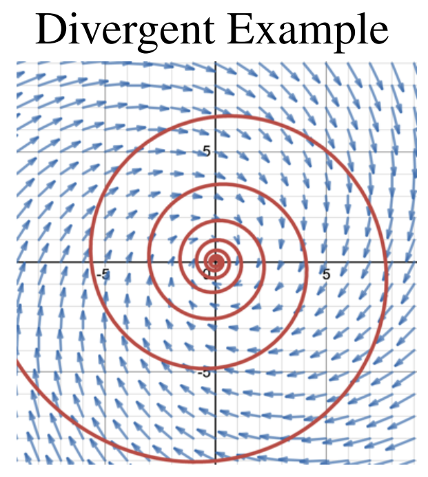
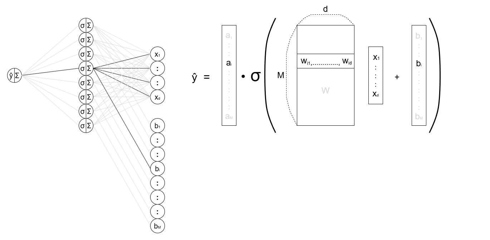
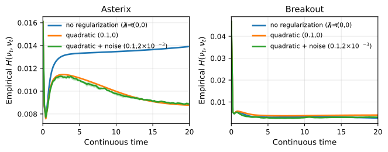

---
layout: section
subject: Background
---

---
layout: default
headerEnable: true
headerTitle: Background
pageNumber: true
---

# Reinforcement Learning

### Markov Decision Process

$$\begin{alignedat}{3}&\text{State Space}\quad&\mathcal{S}&\subseteq\mathbb{R}^n,\;\text{bounded}\\ &\text{Action Space}\quad&\mathcal{A}&\subseteq\mathbb{R}^m,\;\text{bounded}\\ &\text{Reward}\quad&r&:\mathcal{S}\times\mathcal{A}\to[0,1]\\ \qquad&\text{Transition Model}\quad&P&:\mathcal{S}\times\mathcal{A}\to\mathcal{P}(\mathcal{S})\\ &\text{Policy}\quad&\pi&:\mathcal{S}\to\mathcal{P}(\mathcal{A})\\ \end{alignedat}$$

 
 
 
 
 
 
 
 
 
 
 

### Value function & Bellman Equation

$$\begin{aligned}\text{Value function}\quad V^\pi(s):=\mathbb{E}_{\substack{A_t\sim\pi(\cdot\mid S_t)\\ S_{t+1}\sim P(\cdot\mid S_t,A_t)}}\left[\sum_{t=0}^\infty \gamma^tr(S_t,A_t)\bigg|S_0=s\right],\quad\gamma\in(0,1)\end{aligned}$$

$$\begin{aligned}\text{Bellman Equation}\quad V^\pi(s)=\mathbb{E}_{\substack{A_t\sim\pi(\cdot\mid s)\\ S'\sim P(\cdot\mid s,A_t)}}\bigg[r(s,A)+\gamma V^\pi(S')\bigg]\end{aligned}$$

---
layout: default
headerEnable: true
headerTitle: Background
pageNumber: true
---

# How to Learn Value function?

### Monte Carlo method

$$L(\theta):=\frac{1}{2}\mathbb{E}_{S}\left[\left(\mathbb{E}_{\substack{A_t\sim\pi(\cdot\mid S_t)\\ S_{t+1}\sim P(\cdot\mid S_t,A_t)}}\left[\sum_{t=0}^\infty \gamma^tr(S_t,A_t)\bigg|S_0=s\right]-V(S;\theta)\right)^2\right]$$

$$\theta_{t+1}\leftarrow\theta_t-\eta \nabla_\theta L(\theta_t)$$

 
 
 
 
 
 

### Temporal Difference Method

#### Full-Gradient TD

 
 

$$L(\theta):=\frac{1}{2}\mathbb{E}_{S}\left[\left(\mathbb{E}_{A,S'}\left[r+\gamma V(S';\theta)\right]-V(S;\theta)\right)^2\right]$$

$$\theta_{t+1}\leftarrow\theta_t-\eta \nabla_\theta L(\theta_t)$$

 
 
 
 
 

#### Semi-Gradient TD

 

$$H(\theta,\omega):=\frac{1}{2}\mathbb{E}_{S}\left[\left(\mathbb{E}_{A,S'}\left[r+\gamma V(S';\theta)\right]-V(S;\omega)\right)^2\right]$$

$$\begin{aligned}\omega_{t+1}&\leftarrow\omega_t-\eta \nabla_\omega H(\theta_t, \omega_t),\quad\theta_{t+1}\leftarrow\omega_{t+1}\end{aligned}$$

---
layout: default
headerEnable: true
headerTitle: Background
pageNumber: true
---

# More on Semi Gradient TD

#### Semi-Gradient TD

$$H(\theta,\omega):=\frac{1}{2}\mathbb{E}_{S}\left[\left(\mathbb{E}_{A,S'}\left[r+\gamma V(S';\theta)\right]-V(S;\omega)\right)^2\right]$$

$$\begin{aligned}\omega_{t+1}&\leftarrow\omega_t-\eta \nabla_\omega H(\theta_t, \omega_t),\quad\theta_{t+1}\leftarrow\omega_{t+1}\end{aligned}$$

 
 
 
 
 
 

<MovingTargetFrames
  style="left: 680px; top: 70px;"
/>

#### Semi-Gradient TD is Genellary Not a Gradient of Any Function

$$\theta_{t+1}\leftarrow\theta_t-\eta g(\theta_t)$$

where

$$g(\theta)=-\mathbb{E}_{S}\left[\left(\mathbb{E}_{A,S'}\left[r+\gamma V(S';\theta)\right]-V(S;\theta)\right)\nabla_\theta V(S;\theta)\right]$$

 
 
 
 
 
 

If $g(\theta)=\nabla_\theta F(\theta)$, then $\partial_j g_i(\theta)=\partial_i g_j(\theta)$. However,

$$\partial_j g_i(\theta)-\partial_i g_j(\theta)=\gamma\mathbb{E}\left[\partial_i V(S';\theta)\partial_j V(S;\theta)-\partial_j V(S';\theta)\partial_i V(S;\theta)\right]\neq 0$$

  Source: Brandfonbrener & Bruna (2020), Fig. 1

---
layout: default
headerEnable: true
headerTitle: Background
pageNumber: true
---

# Contributions

|  | Neural Network | Feature learning | Last-iterate convergence | Off-policy extension |
|---|:---:|:---:|:---:|:---:|
| Cai et al. (2019) | ✓ | — | — | ✓ |
| Zhang et al. (2020) | ✓ | ✓ | — | ✓ |
| Agazzi and Lu (2022) | ✓ | — | ✓ | — |
| Asadi et al. (2023) | — | — | ✓ | ✓ |
| **Ours** | ✓ | ✓ | ✓ | ✓ |

 

- In off-policy setting, The policy being evaluated is different from the policy used to collect the data.

- Our convergence guarantee relies on **regularization**, which introduces bias
  relative to the original unregularized Bellman solution.
  We quantify this bias explicitly.

---
layout: default
headerEnable: true
headerTitle: Background
pageNumber: true
---

# Mean-Field Regime

### Two-layer neural network

$$\begin{gathered}\hat{y}(x;\boldsymbol{\theta})=\frac{1}{M}\sum_{i=1}^Ma_i\sigma\left(\left\langle w_i,x\right\rangle+b_i\right)=:\frac{1}{M}\sum_{i=1}^M\phi(x;\theta_i)\\ \bigg(\theta_i:=\left(a_i,w_i,b_i\right)\in\mathbb{R}^{d}\bigg)\end{gathered}$$

$$\begin{gathered}\hat{y}(x;\boldsymbol{\theta})=\frac{1}{M}\sum_{i=1}^Ma_i\sigma\left(\left\langle w_i,x\right\rangle+b_i\right)=:\frac{1}{M}\sum_{i=1}^M\phi(x;\theta_i)\\ \bigg(\theta_i:=\left(a_i,w_i,b_i\right)\in\mathbb{R}^{d}\bigg)\end{gathered}$$

The output $\hat{y}$ is invariant to swapping $\theta_i$ and $\theta_j$.
This motivates representing the network through the empirical measure

$$\hat{y}(x;\boldsymbol{\theta})=\int \phi(x;\theta)\,\mu_M(\mathrm{d}\theta),
\qquad\mu_M=\frac{1}{M}\sum_{i=1}^M\delta_{\theta_i}.$$

As $M\to\infty$, the empirical measure $\mu_M$ is replaced by a probability
measure $\mu\in\mathcal{P}(\mathbb{R}^d)$, giving

$$
\hat{y}(x;\mu)
=
\int \phi(x;\theta)\,\mu(\mathrm{d}\theta).
$$

---
layout: default
headerEnable: true
headerTitle: Background
pageNumber: true
---

# Example: Supervised Learning

#### Regularized objective function

$$E(\mu)=\frac{1}{2}\mathbb{E}_{(x,y)\sim\rho}\left[\left(\hat y(x;\mu)-y\right)^2\right]+\frac{\lambda}{2}\int \|\theta\|^2\,\mu(d\theta),\quad F(\mu)=E(\mu)+\tau\mathrm{Ent}(\mu).$$

where $\tau\mathrm{Ent}(\mu)=\int\log{\left(\frac{d\mu}{d\theta}(\theta)\right)}\mu(d\theta)$

#### Parameter update rule

$$\theta_i^{k+1}=\theta_i^k-\eta\nabla_\theta\frac{\delta E}{\delta\mu}(\mu_k)(\theta_i^k)+\sqrt{2\tau\eta}\,\xi_i^k,\qquad \xi_i^k\sim\mathcal{N}(0,I),\qquad \mu_k=\frac{1}{M}\sum_{i=1}^M\delta_{\theta_i^k}.$$

#### Continuous-time limit

$$\begin{aligned}\mathrm{d}\theta_t&=-\nabla_\theta\frac{\delta E}{\delta\mu}(\mu_t)(\theta_t)\,\mathrm{d}t+\sqrt{2\tau}\,\mathrm{d}W_t,\\[4pt]\partial_t\mu_t&=\nabla_\theta\cdot\left(\mu_t\nabla_\theta\frac{\delta F}{\delta\mu}(\mu_t)\right),\qquad \mu_t=\operatorname{Law}(\theta_t).\end{aligned}$$

Continuity equation: $\partial_t\mu_t+\nabla_\theta\cdot(\mu_t v_t)=0$

$\Longrightarrow v_t(\theta)=-\nabla_\theta\frac{\delta F}{\delta\mu}(\mu_t)(\theta)$

$\Longrightarrow \frac{d}{dt}F(\mu_t)=-\int\left\|\nabla_\theta\frac{\delta F}{\delta\mu}(\mu_t)(\theta)\right\|^2\mu_t(d\theta).$

$$\boxed{\begin{aligned}\frac{d}{dt}\bigl(f(x_t)-f^\star\bigr)=&-\|\nabla f(x)\|^2\\ \overset{\text{PL condition}}{\leq}& -2\alpha\bigl(f(x_t)-f^\star\bigr).\end{aligned}}$$

Thus, the mean-field dynamics are the Wasserstein gradient flow of $F$.

---
layout: default
headerEnable: true
headerTitle: Background
pageNumber: true
---

# Example: Supervised Learning

#### Key tools

Define the minimizer of the linearized objective and the global minimizer by
$$\pi_\mu:=\operatorname*{argmin}_{\nu}\left\{\int \frac{\delta E}{\delta\mu}(\mu)(\theta)\,\nu(d\theta)+\tau\mathrm{Ent}(\nu)\right\},\, \pi_*:=\operatorname*{argmin}_{\mu}F(\mu).$$

  

    Assumption.
    Uniform Log-Sobolev Inequality
  

  

There exists $\rho_{\lambda,\tau}>0$ s.t.

$$\mathrm{KL}(\nu\|\pi_\mu)\le\frac{1}{2\rho_{\lambda,\tau}}I(\nu\|\pi_\mu),\qquad \forall\,\mu,\nu.$$

where $I(\nu\|\pi_\mu)=\int\|\nabla_\theta\log(d\nu/d\pi_\mu)\|^2\,d\nu$.
  

  <b>Intuition.</b> A large gap to the linearized optimum implies a large descending force.

  

    Lemma.
    Entropy Sandwich (Informal) (Nitanda et al. (2022) and Chizat (2022))
  

  

The free-energy gap is sandwiched by relative entropy:
$$\tau\mathrm{KL}(\mu\|\pi_*)\leq F(\mu)-F(\pi_*)\leq\tau\mathrm{KL}(\mu\|\pi_\mu).$$
  

  <b>Intuition.</b> The Bregman divergence of entropy is KL divergence.

#### Analysis

  

    Theorem.
    Exponential Convergence (Informal) (Nitanda et al. (2022) and Chizat (2022))
  

  

Under suitable regularity, flat convexity, and uniform LSI, the mean-field Langevin dynamics satisfy
$$F(\mu_t)-F(\pi_*)\leq e^{-2\tau\rho_{\lambda,\tau} t}\left(F(\mu_0)-F(\pi_*)\right).$$
  

_Proof Sketch._

Along the mean-field Langevin dynamics,
$$\begin{aligned}\frac{d}{dt}\left(F(\mu_t)-F(\pi_*)\right)&=-\tau^2 I(\mu_t\|\pi_{\mu_t})\\&\overset{\text{LSI}}{\leq} -2\rho_{\lambda,\tau}\tau^2\mathrm{KL}(\mu_t\|\pi_{\mu_t})\\&\overset{\substack{\text{Entropy}\\ \text{Sandwich}}}{\leq} -2\rho_{\lambda,\tau}\tau\left(F(\mu_t)-F(\pi_*)\right).\end{aligned}$$

Therefore, Gronwall gives
$$F(\mu_t)-F(\pi_*)\leq e^{-2\tau\rho_{\lambda,\tau} t}\left(F(\mu_0)-F(\pi_*)\right).$$

---
layout: section
subject: Main Results
---

---
layout: two-cols
headerEnable: true
headerTitle: Main Results
pageNumber: true
---

# Mean-Field Semi-Gradient TD

#### Regularized objective function

$$E(\mu,\nu)=\frac{1}{2}\mathbb{E}_{S}\left[\left(\mathbb{E}_{A,S'}\left[r+\gamma V(S';\mu)\right]-V(S;\nu)\right)^2\right]+\frac{\lambda}{2}\int \|\theta\|^2\,\nu(d\theta),\quad F(\mu)=E(\mu)+\tau\mathrm{Ent}(\nu),$$

where $\mathrm{Ent}(\nu)=\int\log{\left(\frac{d\nu}{d\theta}(\theta)\right)}\nu(d\theta)$.

#### Parameter update rule

$$\theta_i^{k+1}=\theta_i^k-\eta\nabla_\theta\frac{\delta E}{\delta\nu}(\mu_k,\mu_k)(\theta_i^k)+\sqrt{2\tau\eta}\,\xi_i^k,\quad\text{where}\quad\xi_i^k\sim\mathcal{N}(0,I).$$

Here, $\frac{\delta F}{\delta\mu}$ and $\frac{\delta F}{\delta \nu}$ denote variations with respect to the first and second arguments.

#### Continuous-time limit

$$\begin{aligned}d\theta_t&=-\nabla_\theta\frac{\delta E}{\delta\nu}(q_t,q_t)(\theta_t)\,dt+\sqrt{2\tau}\,dW_t,\\\partial_tq_t&=\nabla_\theta\cdot\left(q_t\nabla_\theta\frac{\delta F}{\delta\nu}(q_t,q_t)\right).\end{aligned}$$

Unlike supervised learning, this is **not** the Wasserstein gradient flow of $q\mapsto F(q,q)$, since

$$\frac{\delta}{\delta q}F(q,q)=\frac{\delta F}{\delta\mu}(q,q)+\frac{\delta F}{\delta\nu}(q,q).$$

---
layout: two-cols
headerEnable: true
headerTitle: Main Results
pageNumber: true
---

## Main Result 1

  

    Assumption.
    Mixed Smoothness
  

  

There exists $L_p>0$ s.t.

$$\left\|\nabla_\theta\left[\frac{\delta H}{\delta\mu}(\mu,\nu_1)(\theta)-\frac{\delta H}{\delta\mu}(\mu,\nu_2)(\theta)\right]\right\|\le L_pW_2(\nu_1,\nu_2),\qquad \forall\,\mu,\nu_1,\nu_2,\theta.$$

  

  <b>Intuition.</b> $L_p$ measures the sensitivity to the moving bootstrap target.

Define

$$T(\mu):=\operatorname*{argmin}_{\nu}F(\mu,\nu),\qquad G(t):=F(\nu_t,\nu_t)-F(\nu_t,T(\nu_t)).$$

  

    Theorem1.
    Exponential Convergence of Semi-Gradient TD (Informal)
  

  

Under suitable regularity, uniform LSI, and mixed smoothness, if

$$\tau\rho_{\lambda,\tau}>L_p,$$

then $T$ has a unique fixed point $\nu^\star=T(\nu^\star)$ and

$$W_2(\nu_t,\nu^\star)\le\frac{\sqrt{2\tau\rho_{\lambda,\tau}}}{\tau\rho_{\lambda,\tau}-L_p}\sqrt{G(0)}\,e^{-(\tau\rho_{\lambda,\tau}-L_p)t}.$$

  

#### Proof Structure

  

    Lemma 1.
    Decay of the Frozen-Target Gap
  

  

If $\tau\rho_{\lambda,\tau}>L_p$, then

$$\frac{d}{dt}G(t)\le -2\left(\tau\rho_{\lambda,\tau}-L_p\right)G(t),$$

and hence

$$G(t)\le e^{-2(\tau\rho_{\lambda,\tau}-L_p)t}G(0).$$

  

  

    Lemma 2.
    Stability of the Moving Optimum
  

  

For every $\mu_1,\mu_2$,

$$W_2\!\left(T(\mu_1),T(\mu_2)\right)\le\frac{L_p}{\tau\rho_{\lambda,\tau}}W_2(\mu_1,\mu_2).$$

Hence, if $\tau\rho_{\lambda,\tau}>L_p$, then $T$ is a contraction and admits a unique fixed point $\nu^\star=T(\nu^\star)$.

  

$$\begin{aligned}&\underset{\text{Lemma }1}{\boxed{\nu_t\text{ approaches }T(\nu_t)}}\quad+\underset{\text{Lemma }2}{\quad\boxed{T(\nu_t)\text{ is closer to }\nu^\star\text{ than }\nu_t}}\\ &\qquad\qquad\qquad\quad\Longrightarrow\text{Theorem }1\end{aligned}$$

---
layout: default
headerEnable: true
headerTitle: Main Results
pageNumber: true
---

### Lemma 1

  

    Lemma 1.
    Decay of the Frozen-Target Gap
  

  

If $\tau\rho_{\lambda,\tau}>L_p$, then

$$\frac{d}{dt}G(t)\le -2(\tau\rho_{\lambda,\tau}-L_p)G(t),\qquad G(t)\le e^{-2(\tau\rho_{\lambda,\tau}-L_p)t}G(0).$$

  

**Key idea.** Instead of differentiating $F(\nu_t,\nu_t)$ directly, track the frozen-target gap

$$G(t)=F(\nu_t,\nu_t)-F(\nu_t,T(\nu_t)).$$

#### Exact Decomposition

Differentiating $G(t)$ using the envelope theorem gives

$$\frac{d}{dt}G(t)=-\underbrace{\|v_t^{\mathrm{opt}}\|_{L^2(\nu_t)}^2}_{\text{optimization}}-\underbrace{\langle v_t^{\mathrm{mov}},v_t^{\mathrm{opt}}\rangle_{L^2(\nu_t)}}_{\text{moving-target effect}}.$$

Here

$$v_t^{\mathrm{opt}}:=\nabla_\theta\frac{\delta F}{\delta\nu}(\nu_t,\nu_t),\qquad v_t^{\mathrm{mov}}:=\nabla_\theta\left[\frac{\delta E}{\delta\mu}(\nu_t,\nu_t)-\frac{\delta E}{\delta\mu}(\nu_t,T(\nu_t))\right].$$

#### Compare the Two Effects

**LSI + entropy sandwich**

$$\|v_t^{\mathrm{opt}}\|_{L^2(\nu_t)}^2\ge 2\tau\rho_{\lambda,\tau}G(t).$$

**Mixed smoothness + Talagrand + entropy sandwich**

$$\|v_t^{\mathrm{mov}}\|_{L^2(\nu_t)}\le\frac{L_p}{\tau\rho_{\lambda,\tau}}\|v_t^{\mathrm{opt}}\|_{L^2(\nu_t)}.$$

Therefore,

$$\frac{d}{dt}G(t)\le-\left(1-\frac{L_p}{\tau\rho_{\lambda,\tau}}\right)\|v_t^{\mathrm{opt}}\|_{L^2(\nu_t)}^2.$$

and hence

$$\frac{d}{dt}G(t)\le-2(\tau\rho_{\lambda,\tau}-L_p)G(t).$$

If $\tau\rho_{\lambda,\tau}>L_p$, the optimization effect is stronger than the moving-target effect, so the frozen-target gap decreases exponentially.

---
layout: default
headerEnable: true
headerTitle: Main Results
pageNumber: true
---

### Lemma 2

  

    Lemma 2.
    Stability of the Moving Optimum
  

  

$$W_2(T(\mu_1),T(\mu_2))\le \frac{L_p}{\tau\rho_{\lambda,\tau}}W_2(\mu_1,\mu_2).$$

  

**Key idea.** Lemma 1 shows that $\nu_t$ approaches its instantaneous optimum $T(\nu_t)$.
For convergence, we also need the optimum itself to move stably.

#### Compare the Two Optima

We want to control

$$W_2(T(\mu_1),T(\mu_2))$$

by the change $W_2(\mu_1,\mu_2)$.

Since $T(\mu_1)$ and $T(\mu_2)$ minimize two different frozen-target objectives, introduce the mixed increment

$$\Delta H:=\bigl[H(\mu_2,T(\mu_1))-H(\mu_1,T(\mu_1))\bigr]-\bigl[H(\mu_2,T(\mu_2))-H(\mu_1,T(\mu_2))\bigr].$$

This compares the effect of changing the target $\mu_1\to\mu_2$ at the two different optima.

#### Bound the Same Quantity from Two Sides

**Lower bound: entropy sandwich + Talagrand**

The optimality of $T(\mu_1)$ and $T(\mu_2)$ gives

$$\tau\rho_{\lambda,\tau}W_2^2(T(\mu_1),T(\mu_2))\le \Delta H.$$

**Upper bound: mixed smoothness**

The change of the objective with respect to its target is controlled by

$$\Delta H\le L_p\,W_2(\mu_1,\mu_2)\,W_2(T(\mu_1),T(\mu_2)).$$

Combining the two bounds yields

$$W_2(T(\mu_1),T(\mu_2))\le\frac{L_p}{\tau\rho_{\lambda,\tau}}W_2(\mu_1,\mu_2).$$

If $\tau\rho_{\lambda,\tau}>L_p$, the moving-optimum map $T$ is a contraction.

---
layout: default
headerEnable: true
headerTitle: Main Results
pageNumber: true
---

## Main Result 2

  

    Theorem 2.
    Approximation and Regularization Error
  

  

Let $\nu^\star$ be the self-consistent equilibrium. Then

$$\begin{aligned}\|V_{\nu^\star}-V^\pi\|_{L^2(d^\pi)}\le\inf_\nu\Bigg\{&\frac{1+\gamma}{1-\gamma}\|V_\nu-V^\pi\|_{L^2(d^\pi)}\\&+\sqrt{\frac{\tau}{1-\gamma}\mathrm{KL}(\nu\|g_{\lambda,\tau})}\Bigg\},\end{aligned}$$

where $g_{\lambda,\tau}=\mathcal N(0,\frac{\tau}{\lambda}I)$.
  

#### How Can We Control the Bias?

The equilibrium $\nu^\star$ does not solve the Bellman equation directly.
But it **does** minimize the frozen-target objective:

$$\nu^\star\in\operatorname*{argmin}_\nu F(\nu^\star,\nu).$$

So compare $\nu^\star$ with an arbitrary parameter law $\nu$, and convert this optimality condition into an inequality for $V_{\nu^\star}-V^\pi$.

#### From Optimality to Bellman Error

The regularization terms can be written as

$$R(\nu)+\tau\mathrm{Ent}(\nu)=\tau\mathrm{KL}(\nu\|g_{\lambda,\tau})+\mathrm{const}.$$

First-order optimality of $\nu^\star$ therefore gives

$$\left\langle V_{\nu^\star}-T^\pi V_{\nu^\star},\,V_\nu-V_{\nu^\star}\right\rangle_{L^2(d^\pi)}+\tau\Big[\mathrm{KL}(\nu\|g_{\lambda,\tau})-\mathrm{KL}(\nu^\star\|g_{\lambda,\tau})\Big]\ge0.$$

Since $V^\pi=T^\pi V^\pi$,

$$V_{\nu^\star}-T^\pi V_{\nu^\star}=(I-\gamma P^\pi)(V_{\nu^\star}-V^\pi).$$

Because $d^\pi$ is stationary,

$$\|P^\pi f\|_{L^2(d^\pi)}\le\|f\|_{L^2(d^\pi)},$$

hence

$$\left\langle(I-\gamma P^\pi)e,e\right\rangle\ge(1-\gamma)\|e\|^2,\qquad \|(I-\gamma P^\pi)e\|\le(1+\gamma)\|e\|,$$

with $e:=V_{\nu^\star}-V^\pi$.

Substituting these bounds into the optimality inequality yields Theorem 2.

---
layout: default
headerEnable: true
headerTitle: Further Background
pageNumber: true
---

# Soft Q-Learning

### Value Function and Q Function

$$\begin{aligned}\text{Value function}\qquad V^\pi(s)&:=\mathbb{E}^\pi\left[\sum_{t=0}^\infty \gamma^t r(S_t,A_t)\bigg|S_0=s\right],\\[8pt]\text{Q function}\qquad Q^\pi(s,a)&:=\mathbb{E}^\pi\left[\sum_{t=0}^\infty \gamma^t r(S_t,A_t)\bigg|S_0=s,\ A_0=a\right].\end{aligned}$$

### Soft Bellman Equation

$$Q(s,a)=\mathbb{E}_{S'\sim P(\cdot\mid s,a)}\left[r(s,a)+\gamma V_Q^\beta(S')\right].$$

where $V_Q^\beta(s):=\beta\log\int_{\mathcal A}\exp\left(\frac{Q(s,a)}{\beta}\right)da$.

With off-policy data, the Markov operator need not be non-expansive in the data-weighted $L^2$ norm, and convergence of semi-gradient learning with nonlinear function approximation is not guaranteed in general.

---
layout: default
headerEnable: true
headerTitle: Main Results
pageNumber: true
---

# Soft Q-Learning

Define

$$T_Q(\mu):=\operatorname*{argmin}_{\nu}F_Q(\mu,\nu),\qquad G_Q(t):=F_Q(\nu_t,\nu_t)-F_Q(\nu_t,T_Q(\nu_t)).$$

  

    Theorem 3.
    Exponential Convergence of Soft Q-Learning
  

  

Assume mixed smoothness with constant $L_p^Q$ and uniform LSI with constant $\rho$.

If

$$\rho\tau>L_p^Q,$$

then $T_Q$ has a unique fixed point $\nu_\star^Q$ and

$$W_2(\nu_t,\nu_\star^Q)\le\frac{\sqrt{2\rho\tau}}{\rho\tau-L_p^Q}\sqrt{G_Q(0)}\,e^{-(\rho\tau-L_p^Q)t}.$$

  

The proof has the same structure as policy evaluation: decay of $G_Q(t)$ and contraction of $T_Q$.

  

    Theorem 4.
    Approximation and Regularization Error
  

  

Assume finite $\mathcal S,\mathcal A$ and full support

$$d_{\min}:=\min_{s,a}d_b(s,a)>0.$$

Let $Q_\beta^\star$ be the fixed point of the soft Bellman operator. Then

$$\begin{aligned}\|Q_{\nu_\star^Q}-Q_\beta^\star\|_\infty\le\frac{1}{(1-\gamma)\sqrt{d_{\min}}}\inf_\nu\Bigg\{&\|Q_\nu-T_\beta Q_{\nu_\star^Q}\|_{L^2(d_b)}\\&+\sqrt{\tau\,\mathrm{KL}(\nu\|g_{\lambda,\tau})}\Bigg\}.\end{aligned}$$

  

The $L^2(d_b)$ Bellman residual is converted to a sup-norm error using full support and the sup-norm contraction of the soft Bellman operator.

---
layout: default
headerEnable: true
headerTitle: Convergence Analysis
pageNumber: true
---

## Neumerical Example

---
layout: section
subject: Conclusion
---

# Conclusion

---
layout: default
headerEnable: true
headerTitle: Conclusion
pageNumber: true
---

# Conclusion

- Semi-gradient TD is not a gradient flow because the bootstrap target moves with the parameters.
- In the mean-field regime, convergence is guaranteed when the optimization strength $\tau\rho$ dominates the moving-target sensitivity $L_p$.
- The proof combines tracking of the frozen-target optimum with stability of the moving optimum.
- The limiting equilibrium may be biased, but its error relative to the true value function can be quantified.
- The same stability mechanism extends to off-policy soft Q-learning.

---
layout: section
subject: Thank you
hideInToc: true
---
